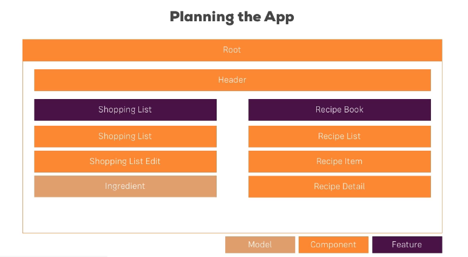

#### Splitting Apps into components

Splitting up the components and preparing to use binding techniques to update multiple components simultaneously.

#### Property and Event Binding Ooverview



### Binding to Custom Properties

So, you create an element

```
element: {
    type: string, name: string, content: string
  };
```

properties cannot be accesses from outside their components, by default.

@Input allows you to access these properties.

```
@Input() element: {
    type: string, name: string, content: string
  };
```

Make sure to import @Input

```
import { Input } from '@angular/core';
```

#### Assigning an Alias to custom Events

You can change the name by which you bind to the property

```
@Input('srvElement') element: {
    type: string, name: string, content: string
  };
```

Which will change how other components access the element

```
<div class="container">
  <app-cockpit></app-cockpit>
  <hr>
  <div class="row">
    <div class="col-xs-12">
      <app-server-element *ngFor="let serverElement of serverElements"
        [srvElement]="serverElement"></app-server-element>
    </div>
  </div>
</div>
```

#### Custom Property and Event Binding Summary

Dude, creating your own events and binding stuff to it is sliiiick.

cockpit.component.ts

```
@Output('bpCreated') blueprintCreated = new EventEmitter<{ serverName: string, serverContent: string }>();
```

```
onAddBlueprint() {
    this.blueprintCreated.emit({ serverName: this.newServerName, serverContent: this.newServerContent });
  }
```

### View Encapsulation

Angular enforces behavior that is not native to the browser, limiting the influence of .css files to the component that they are grouped with.

You can change the encapsulation

```
@Component({
  selector: 'app-server-element',
  templateUrl: './server-element.component.html',
  styleUrls: ['./server-element.component.css'],
  encapsulation: ViewEncapsulation.Emulated //(Default is Emulated), None, and ShadowDom
})
```

### Local Refs in Templates

Local refs are good if you don't need two way binding and just need the value temporarily. Like passing it immediately to whatever needs it.

```
<input type="text" class="form-control" #serverNameInput>
```
`#serverNameInput` is the local ref

**Important** This will hold a reference to the <b>Element</b> not the *value* of the element.
Also, you can only use this in the template(.cs) of the component.


### Getting Access to the Template and DOM with @ViewChild

From the Video lecture:

In Angular 8+, the @ViewChild() syntax which you'll see in this lecture needs to be changed slightly:

Instead of:

`@ViewChild('serverContentInput') serverContentInput: ElementRef;`

use

`@ViewChild('serverContentInput', {static: true}) serverContentInput: ElementRef;`
The same change (add `{ static: true }` as a second argument) needs to be applied to ALL usages of @ViewChild() (and also `@ContentChild()` which you'll learn about later) IF you plan on accessing the selected element inside of `ngOnInit()`.

If you DON'T access the selected element in ngOnInit (but anywhere else in your component), set `static: false` instead!

For projects using Angular 9 or higher (check the package.json file to find out), you can omit `static: false`, you only need to specify static: true if you plan on using the selected element inside of `ngOnInit()`. This is because Angular 9+ sets `static: false` by default.

`@ViewChild('serverContentInput') serverContentInput;`


The `@ViewChild` decorator allows you to access the local ref in the template. This passes in an ElementRef object.

(.ts) file

`@ViewChild('serverContentInput') serverContentInput: ElementRef;`

Make sure to import ElementRef from @angular/core

Accessed by:
```
onAddServer(nameInput: HTMLInputElement) {
    this.serverCreated.emit({
      serverName: nameInput.value,
      serverContent: this.serverContentInput.nativeElement.value
    });
  }
```

### Projecting Content into Components with ng-content

I am not entirely sure how this works, but it is a way to pass content into a component.

*In the component that you want to pass content into, add the following to the template:*
```<ng-content></ng-content>```

server-element.component.html
```
<div class="panel panel-default">
  <div class="panel-heading">{{ element.name }}</div>
  <div class="panel-body">
    <ng-content></ng-content>
  </div>
</div>
```

*In the component that you want to pass content from, add the following to the template:*

app.component.html

```
<app-server-element>
  <p>
    <strong *ngIf="element.type === 'server'" style="color: red">{{ element.content }}</strong>
    <em *ngIf="element.type === 'blueprint'">{{ element.content }}</em>
  </p>
</app-server-element>
```

What I don't get currently is how the content is passed from the app.component.html to the server-element.component.html
What tells it to pass the content from the app.component.html to the server-element.component.html?
Is it the ngIf, are all NG directives connected to ng-content? Automatically?

OH! I think it's because we placed it INSIDE the app-server-element tags. You aren't passing the content to the app-server component, you're rendering in app.component.html and just adding to the app-server-element tag after that tag has been pulled from the other component.

Wait, this has to have something to do with viewChild.


### Understanding the Component Lifecycle

Angular goes through phases when it starts up.

- ngOnChanges: Called after a bound input property changes
- ngOnInit: Called once the component is initialized
- ngDoCheck: Called during every change detection run

This sounds expensive, CPU wise, but angular is very efficient with this..

- ngAfterContentInit: Called after content (ng-content) has been projected into view
- ngAfterContentChecked: Called every time the projected content has been checked
- ngAfterViewInit: Called after the component's view (and child views) has been initialized
- ngAfterViewChecked: Called every time the view (and child views) have been checked
- ngOnDestroy: Called once the component is about to be destroyed

### Seeing Lifecycle Hooks in Action

Which ever lifecyle you wish to interact with must be imported from @angular/core

```
import { Component, OnInit, Input, OnChanges, SimpleChanges } from '@angular/core';
```

```
export class ServerElementComponent implements OnInit, OnChanges {
  @Input('srvElement') element: {
    type: string, name: string, content: string
  };
  constructor() { }
  
  ngOnChanges() { }

  ngOnInit() {

  }
}
```

Reference this project's server-element.component.ts for more the sequence of the lifecycle hooks.

### Lifecycle Hooks and Template Access

You can access the template after the view has been initialized.

```ngAfterViewInit()```

### Getting Access to ng-content with @ContentChild

From the Video lecture:

As mentioned a few lectures ago, in Angular 8+, the @ViewChild() and @ContentChild() syntaxes need to be changed slightly:

Instead of:

@ContentChild('contentParagraph') paragraph: ElementRef;
use

@ContentChild('contentParagraph', {static: true}) paragraph: ElementRef;
If you DON'T access the selected element in ngOnInit (but anywhere else in your component), set static: false instead!
For projects using Angular 9 or higher (check the package.json file to find out), you can omit static: false, you only need to specify static: true if you plan on using the selected element inside of ngOnInit().

`@ContentChild('contentParagraph') paragraph: ElementRef;`

### Wrap Up