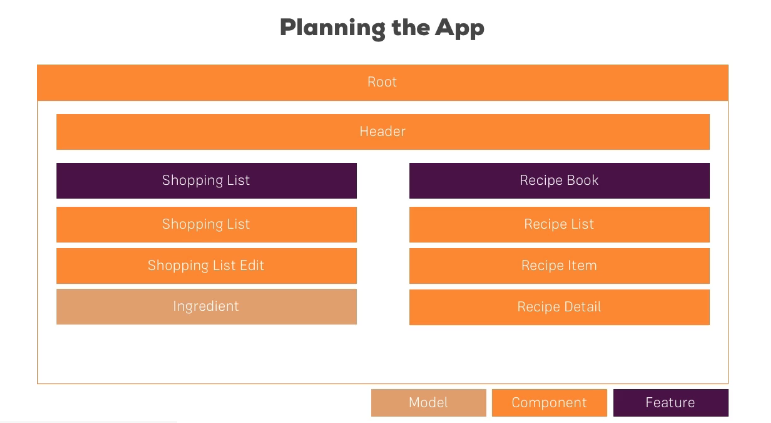

The planned layout of the project.

File structure is a bit more complex than projects so far.

So we go through, lining up HTML in .ts files, then moving onto the parts that make up the different sections. Putting in temporary place holders, and then coming back through later with interpolation and binding seems to keep me from being too overwhelmed with keeping track of what goes where.

All in all, there's about 7 custom components and a dozen imports in the module

Seeing him just throw an \*ngFor into a random a href tag was super cool. I need to learn how this thing works. Is it limited to `<a>` tags?

No, it is not limited to `<a>`. Fantastic.

\*ngFor Definition:

`A structural directive that renders a template for each item in a collection. The directive is placed on an element, which becomes the parent of the cloned templates.`

So, like, any element? span, div, etc? ==Cool==

`<a href="#" *ngFor="let recipe of recipes">`

Everything between the `<a>` and the `</a>` is then home to bindings and interpolations from the following section of `recipe.component.ts`

```
export class RecipesListComponent implements OnInit {
  recipes: Recipe[] = [
    new Recipe('Pancakes', 'Tasty!', 'URL'),
    new Recipe('Pancakes', 'Tasty!', 'URL')
  ];
```

#### Debugging

Alot of debugging is similar to .js tracking, etc.

The source mapping warrants some further research and use.
