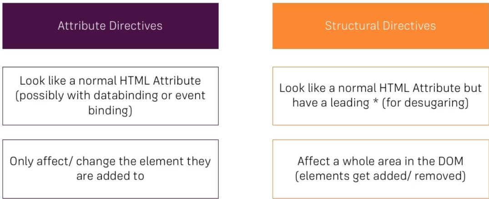

### Attribute vs. Structural directives



### ngFor and ngIf Recap

You cannot put more than one structural directive(ex. *ngFor) on an attribute.

### ngClass and ngStyle Recap
```
<div class="container">
  <div class="row">
    <div class="col-xs-12">
      <button class="btn btn-primary" (click)="onlyOdd = !onlyOdd">Only show Odd #s</button>
      <br><br>
      <ul class="list-group">
        <div *ngIf="onlyOdd">
          <li class="list-group-item"
              [ngClass]="{odd: odd % 2 !== 0}"
              [ngStyle]="{backgroundColor: odd % 2 !== 0 ? 'yellow' : 'transparent'}"
              *ngFor="let odd of oddNumbers"> {{odd}} </li>
        </div>
        <div *ngIf="!onlyOdd">
          <li class="list-group-item"
              [ngClass]="{even: even % 2 === 0}"
              [ngStyle]="{backgroundColor: odd % 2 !== 0 ? 'lightgreen' : 'transparent'}"
              *ngFor="let even of evenNumbers"> {{even}} </li>
        </div>
      </ul>
    </div>
  </div>
</div>


//CSS
.container {
  margin-top: 30
}

.odd {
  color: red;
}

.even {
  color: blue;
}


```

### Creating a Basic Attribute Directive

**basic-highlight.directive.ts**

The brackets around the selector are important. They tell Angular that this is not a normal HTML attribute, but a directive. You can use this tag without the brackets.

It is not good practice to manipulate the DOM directly. Angular provides a better way to do this. 

```
import { Directive, ElementRef, OnInit } from "@angular/core";


@Directive({
  selector: '[appBasicHighlight]'
})

export class BasicHighlightDirective implements OnInit {
  constructor(private elementRef: ElementRef) {
  }

  ngOnInit() {
    this.elementRef.nativeElement.style.backgroundColor = 'green';
  }
}
```

**app.module.ts**
```
import { BasicHighlightDirective } from './basic-highlight/basic-highlight.directive';

@NgModule({
  declarations: [
    AppComponent,
    BasicHighlightDirective
  ],
  imports: [
    BrowserModule,
    FormsModule
  ],
  providers: [],
  bootstrap: [AppComponent]
})
export class AppModule { }

```

**app.component.html**
```
<p appBasicHighlight>Style me with basic directive</p>
```

### Using the Renderer to build a Better Attribute Directive

**better-highlight.directive.ts**

Using the renderer is better than using the ElementRef. Angular is able to operate on platforms other than the DOM. ElementRef is only for the DOM. Renderer works without the DOM.


```
import { Directive, Renderer2, OnInit, ElementRef } from '@angular/core';

@Directive({
  selector: '[appBetterHighlight]'
})
export class BetterHighlightDirective implements OnInit {

  constructor(private elRef: ElementRef, private renderer: Renderer2) { }

  ngOnInit(): void {
    this.renderer.setStyle(this.elRef.nativeElement, 'background-color', 'blue');
  }
}
```

### Using HostListener to Listen to Host Events

**better-highlight.directive.ts**

```
import { Directive, Renderer2, OnInit, ElementRef, HostListener } from '@angular/core';

@Directive({
  selector: '[appBetterHighlight]'
})

export class BetterHighlightDirective implements OnInit {

  constructor(private elRef: ElementRef, private renderer: Renderer2) { }

  ngOnInit(): void {
    // this.renderer.setStyle(this.elRef.nativeElement, 'background-color', 'blue');
  }

  @HostListener('mouseenter') mouseover(eventData: Event) {
    this.renderer.setStyle(this.elRef.nativeElement, 'background-color', 'blue');
  }

  @HostListener('mouseleave') mouseleave(eventData: Event) {
    this.renderer.setStyle(this.elRef.nativeElement, 'background-color', 'transparent');
  }
}
```

### Using HostBinding to Bind to Host Properties

**better-highlight.directive.ts**

```
import { Directive, Renderer2, OnInit, ElementRef, HostListener, HostBinding } from '@angular/core';

@Directive({
  selector: '[appBetterHighlight]'
})

export class BetterHighlightDirective implements OnInit {

  @HostBinding('style.backgroundColor') backgroundColor: string = 'transparent';

  constructor(private elRef: ElementRef, private renderer: Renderer2) { }

  ngOnInit(): void {
    // this.renderer.setStyle(this.elRef.nativeElement, 'background-color', 'blue');
  }

  @HostListener('mouseenter') mouseover(eventData: Event) {
    // this.renderer.setStyle(this.elRef.nativeElement, 'background-color', 'blue');
    this.backgroundColor = 'blue';
  }

  @HostListener('mouseleave') mouseleave(eventData: Event) {
    // this.renderer.setStyle(this.elRef.nativeElement, 'background-color', 'transparent');
    this.backgroundColor = 'transparent';
  }
}
```

### Binding to Directive Properties

**better-highlight.directive.ts**

```
import { Directive, Renderer2, OnInit, ElementRef, HostListener, HostBinding, Input } from '@angular/core';

@Directive({
  selector: '[appBetterHighlight]'
})

export class BetterHighlightDirective implements OnInit {
  @Input() defaultColor: string = 'transparent';
  @Input() highlightColor: string = 'blue';
  @HostBinding('style.backgroundColor') backgroundColor: string;

  constructor(private elRef: ElementRef, private renderer: Renderer2) { }

  ngOnInit(): void {
    this.backgroundColor = this.defaultColor;
    //this.renderer.setStyle(this.elRef.nativeElement, 'background-color', 'blue');
  }

  @HostListener('mouseenter') mouseover(eventData: Event) {
    //this.renderer.setStyle(this.elRef.nativeElement, 'background-color', 'blue');
    this.backgroundColor = this.highlightColor;
  }

  @HostListener('mouseleave') mouseleave(eventData: Event) {
    //this.renderer.setStyle(this.elRef.nativeElement, 'background-color', 'transparent');
    this.backgroundColor = this.defaultColor;
  }
}
```

**app.component.html**

You can bind to the directive properties like this.


```
<p appBasicHighlight>Style me with basic Directive!</p>
      <p appBetterHighlight
          [defaultColor]="'red'"
          [highlightColor]="'green'">Style me with a better Directive!</p>
```

Setting an alias, if the alias is the same as the selector name you have to use brackets.

```
@Input('appBetterHighlight') highlightColor: string = 'blue';
```
```
<p appBasicHighlight>Style me with basic Directive!</p>
      <p appBetterHighlight
          [defaultColor]="'red'"
          [appBetterHighlight]="'lightgreen'">Style me with a better Directive!</p>
```