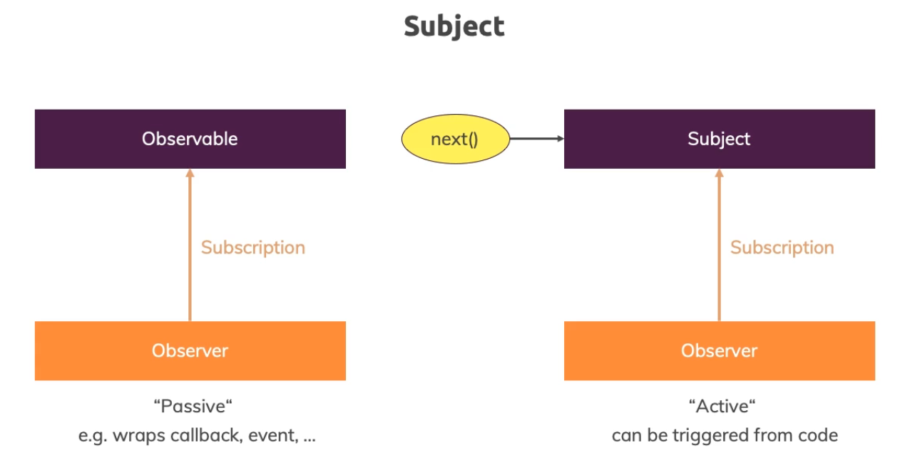

# Observables

Updates and changes to the observables are broadcast to all subscribers. The observables are:


make sure you install RxJS v6 by running

npm install --save rxjs@6
In addition, also install the rxjs-compat package:

npm install --save rxjs-compat


## Getting Closer to the Core of Observables

Built in observables like .params are automatically unsubscribed to when leaving the component subscribed to it. However, if you create your own observables, you need to unsubscribe to them manually. This is done by using the .unsubscribe() method on the observable. This method is called on the observable subscription and takes no arguments.

``` javascript
import { Component, OnInit, OnDestroy } from '@angular/core';
import { ActivatedRoute } from '@angular/router';
import { Subscription } from 'rxjs/Subscription';


@Component({
  selector: 'app-server',
  templateUrl: './server.component.html',
  styleUrls: ['./server.component.css']
})


export class ServerComponent implements OnInit, OnDestroy {
  server: {id: number, name: string, status: string};
  paramsSubscription: Subscription;

  constructor(private serversService: ServersService,
              private route: ActivatedRoute) { }

  ngOnInit() {
    const id = +this.route.snapshot.params['id'];
    this.server = this.serversService.getServer(id);
    this.paramsSubscription = this.route.params
      .subscribe(
        (params: Params) => {
          this.server = this.serversService.getServer(+params['id']);
        }
      );
  }

  ngOnDestroy() {
    this.paramsSubscription.unsubscribe();
  }
}
```

## Building a Custom Observable

``` javascript
import { Component, OnInit, OnDestroy } from '@angular/core';
import { ActivatedRoute } from '@angular/router';
import 'rxjs/Rx';
import { Observable } from 'rxjs/Observable';
import { Subscription } from 'rxjs/Subscription';

export class HomeComponent implements OnInit, OnDestroy {
    private firstObsSubscription: Subscription;

    constructor() { }

    ngOnInit () {
        const customIntervalObservable = Observable.create(observer => {
            let count = 0;
            setInterval(() => {
                observer.next(count);
                count++;
            }, 1000);
            });
        };
    }

    this.firstObsSubscription = customIntervalObservable.subscribe(data => {
        console.log(data);
    });

    ngOnDestroy() {
        this.firstObsSubscription.unsubscribe();
    }

```

## Errors & Completion

Errors can be handles by the obeservable by using the .error() method. This method is called on the observable subscription and takes no arguments.

``` javascript
this.firstObsSubscription = customIntervalObservable.subscribe(data => {
    console.log(data);
}, error => {
    console.log(error);
    alert(error.message);
}, () => {
    console.log('Completed!');
});
```

HTTP requests and other things can be completed by using the .complete() method. This method is called on the observable subscription and takes no arguments.

Errors will stop the observable from completing. But, errors can be handled by using the .error() method and are different from completion.

Aside: interval() is a built in **observable** that emits a sequence of numbers at a specified interval. It is automatically completed.

setInterval() is a built in **JavaScript** function that calls a function or evaluates an expression at specified intervals (in milliseconds). It is not automatically completed.


## Observables and You!

Observables are a powerful tool for handling asynchronous events. They are used in many places in Angular, including the HTTP service and the router. They are also used in many other libraries and frameworks, such as React and Redux.

You will very, very rarely build your own observables. However, you will often subscribe to observables and handle the emitted data.

## Understanding Operators

Operators are functions that you can use on observables and subjects to manipulate emitted data. They are imported from 'rxjs/operators' and are used in the pipe() method.

You can access operators by using the pipe() method on an observable or subject. The pipe() method takes operators as arguments.

``` javascript
import { map, filter } from 'rxjs/operators';

this.firstObsSubscription = customIntervalObservable.pipe(map((data: number) => {
    return 'Round: ' + (data + 1);
}));

```

## Subjects

Subjects are a special type of observable that allows values to be multicasted to many observers. While plain observables are unicast (each subscribed observer owns an independent execution of the observable), subjects are multicast.



Subjects are like event emitters: they maintain a registry of many listeners.

You only use Subjects if you want to multicast data across components.
Event emitters should still be used when using @Output() and EventEmitter.

## Subjects vs Observables

Subjects are both an observable and an observer. They are an observable because they can be subscribed to. They are an observer because they can emit values.


## Subjects as Event Emitters

Subjects are often used as event emitters. They are used in the same way as event emitters, but they are more powerful.

``` javascript
import { Component, OnInit, OnDestroy } from '@angular/core';
import { ActivatedRoute } from '@angular/router';
import 'rxjs/Rx';
import { Observable } from 'rxjs/Observable';
import { Subscription } from 'rxjs/Subscription';
import { Subject } from 'rxjs/Subject';

export class HomeComponent implements OnInit, OnDestroy {
    private firstObsSubscription: Subscription;
    private destroy = new Subject<boolean>();

    constructor() { }

    ngOnInit () {
        const customIntervalObservable = Observable.create(observer => {
            let count = 0;
            setInterval(() => {
                observer.next(count);
                count++;
            }, 1000);
            });
        };
    }

    this.firstObsSubscription = customIntervalObservable.pipe(takeUntil(this.destroy$)).subscribe(data => {
        console.log(data);
    });

    ngOnDestroy() {
        this.destroy.next(true);
        // Now let's also unsubscribe from the subject itself:
        this.destroy.unsubscribe();
    }

```

