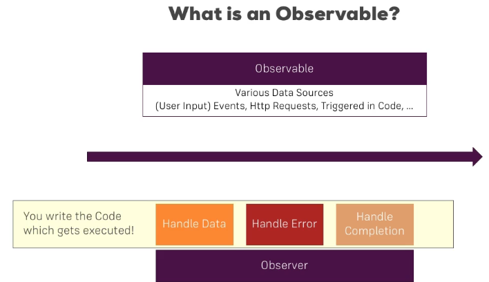

# Observables

Updates and changes to the observables are broadcast to all subscribers. The observables are:



make sure you install RxJS v6 by running

npm install --save rxjs@6
In addition, also install the rxjs-compat package:

npm install --save rxjs-compat


## Getting Closer to the Core of Observables

Built in observables like .params are automatically unsubscribed to when leaving the component subscribed to it. However, if you create your own observables, you need to unsubscribe to them manually. This is done by using the .unsubscribe() method on the observable. This method is called on the observable subscription and takes no arguments.

``` javascript
import { Component, OnInit, OnDestroy } from '@angular/core';
import { ActivatedRoute } from '@angular/router';
import { Subscription } from 'rxjs/Subscription';


@Component({
  selector: 'app-server',
  templateUrl: './server.component.html',
  styleUrls: ['./server.component.css']
})


export class ServerComponent implements OnInit, OnDestroy {
  server: {id: number, name: string, status: string};
  paramsSubscription: Subscription;

  constructor(private serversService: ServersService,
              private route: ActivatedRoute) { }

  ngOnInit() {
    const id = +this.route.snapshot.params['id'];
    this.server = this.serversService.getServer(id);
    this.paramsSubscription = this.route.params
      .subscribe(
        (params: Params) => {
          this.server = this.serversService.getServer(+params['id']);
        }
      );
  }

  ngOnDestroy() {
    this.paramsSubscription.unsubscribe();
  }
}
```

## Building a Custom Observable

``` javascript
import { Component, OnInit, OnDestroy } from '@angular/core';
import { ActivatedRoute } from '@angular/router';
import 'rxjs/Rx';
import { Observable } from 'rxjs/Observable';
import { Subscription } from 'rxjs/Subscription';

export class HomeComponent implements OnInit, OnDestroy {
    private firstObsSubscription: Subscription;

    constructor() { }

    ngOnInit () {
        const customIntervalObservable = Observable.create(observer => {
            let count = 0;
            setInterval(() => {
                observer.next(count);
                count++;
            }, 1000);
            });
        };
    }

    this.firstObsSubscription = customIntervalObservable.subscribe(data => {
        console.log(data);
    });

    ngOnDestroy() {
        this.firstObsSubscription.unsubscribe();
    }

```

## Errors & Completion

``` javascript
import { Component, OnInit, OnDestroy } from '@angular/core';
import { ActivatedRoute } from '@angular/router';
import 'rxjs/Rx';
import { Observable } from 'rxjs/Observable';
import { Subscription } from 'rxjs/Subscription';

